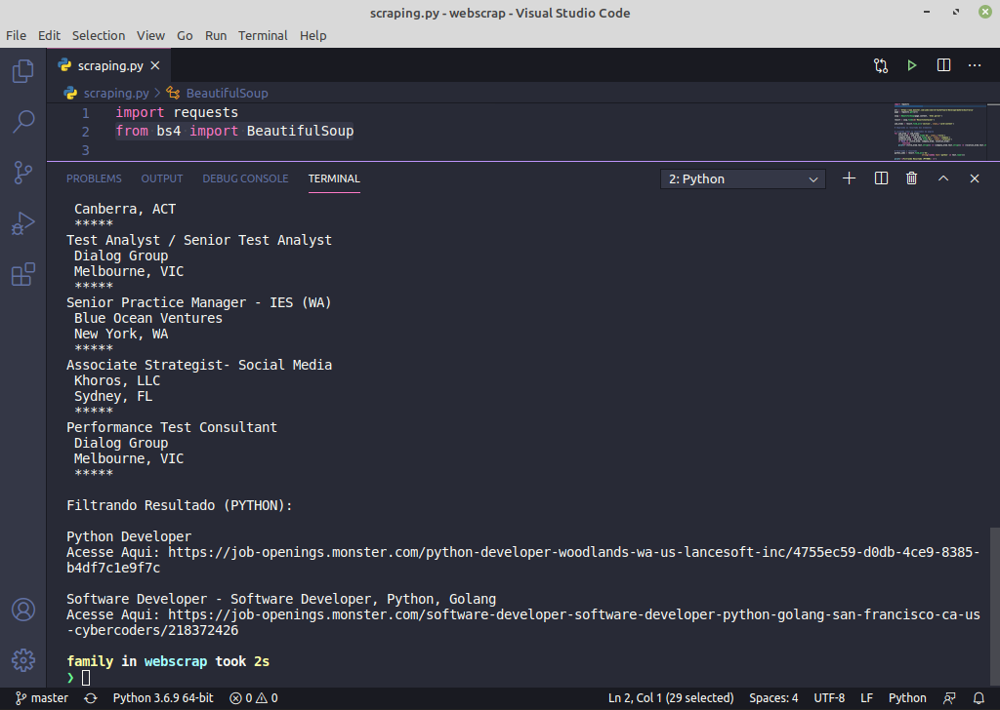

## 
  Webscraping-Jobs 

Testing webscraping on Jobs Seach Website.

Used BeatifulSoup for extract info on website Monster.

__Dependencies__
- import requests
- from bs4 import BeautifulSoup

Result Example:

**Created by:** _Jefferson da Silva_
